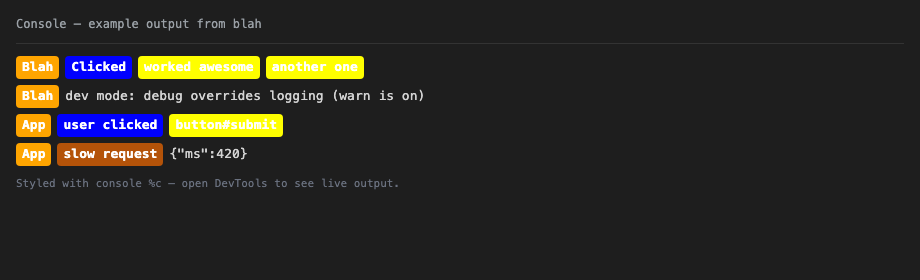
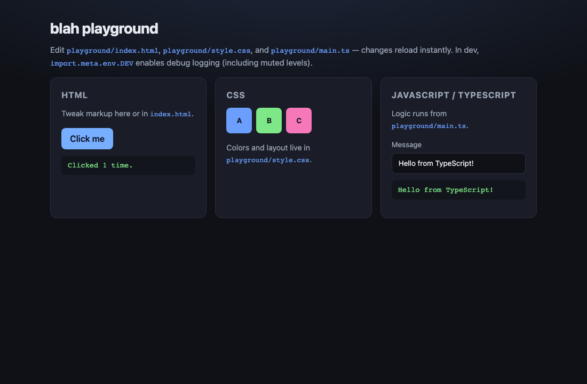

# blah

[](https://opensource.org/licenses/ISC)

Open-source **browser** console logger with a namespace badge and per-argument colors using `console` `%c` CSS.

> **Browser only** — relies on DevTools `%c` styling. Not for Node/terminal output.

## Install

```bash
npm install @mourtazag/blah
```

## Quick start

```ts
import Blah from '@mourtazag/blah'

const logger = new Blah({
  namespace: {
    name: 'App',
    style: { color: 'white', bgColor: '#f97316' },
  },
  argStyles: [
    { color: 'white', bgColor: '#2563eb' },
    { color: 'black', bgColor: '#facc15' },
  ],
})

logger.log('user clicked', 'button#submit')
logger.warn('slow request', { ms: 420 })
```

Open DevTools → **Console** to see colored badges.

## Examples

### Console output

Each segment gets its own colored badge (namespace + one badge per argument):



### Playground

Run `npm run dev` and open http://localhost:3000 to try the interactive demo:



Regenerate screenshots after UI changes:

```bash
npm run screenshots
```

## Logging controls

Mute output globally or per level:

```ts
const logger = new Blah({
  namespace: { name: 'App' },
  logging: {
    enabled: true,
    log: true,
    info: true,
    warn: false,
    error: true,
  },
})
```

**Debug mode** overrides `logging` and always prints:

```ts
const logger = new Blah({
  namespace: { name: 'App' },
  logging: { enabled: false },
  debug: import.meta.env.DEV,
})

logger.setDebug(true)
logger.setLogging({ warn: false })
logger.isEnabled('warn') // false unless debug is on
```

## API

### `new Blah(options)`

| Option | Type | Description |
|--------|------|-------------|
| `namespace` | `NamespaceConfig` | Badge label + optional `style` |
| `argStyles` | `BadgeStyle[]` | CSS per log argument (by index) |
| `logging` | `LoggingConfig` | Enable/disable levels |
| `debug` | `boolean` | Force all levels on |

### Methods

- `log(...args)` / `info` / `warn` / `error`
- `setLogging(config)` — merge logging flags
- `setDebug(debug)` — toggle debug override
- `isEnabled(level)` — check if a level would print

### Types (exported)

`BadgeStyle`, `NamespaceConfig`, `BlahOptions`, `LoggingConfig`, `LogLevel`

## Local development

```bash
git clone <your-repo-url>
cd blah
npm install
npm run dev          # playground at http://localhost:3000
npm test
npm run build:lib    # dist/ for npm
npm pack --dry-run   # preview published tarball
```

Playground lives in `playground/`; the publishable package is `src/` → `dist/`.

## License

This project is **open source** under the [ISC License](LICENSE) (OSI-approved, permissive — similar to MIT).

You may use, copy, modify, and distribute it freely, including in commercial projects, as long as the license notice is preserved.
